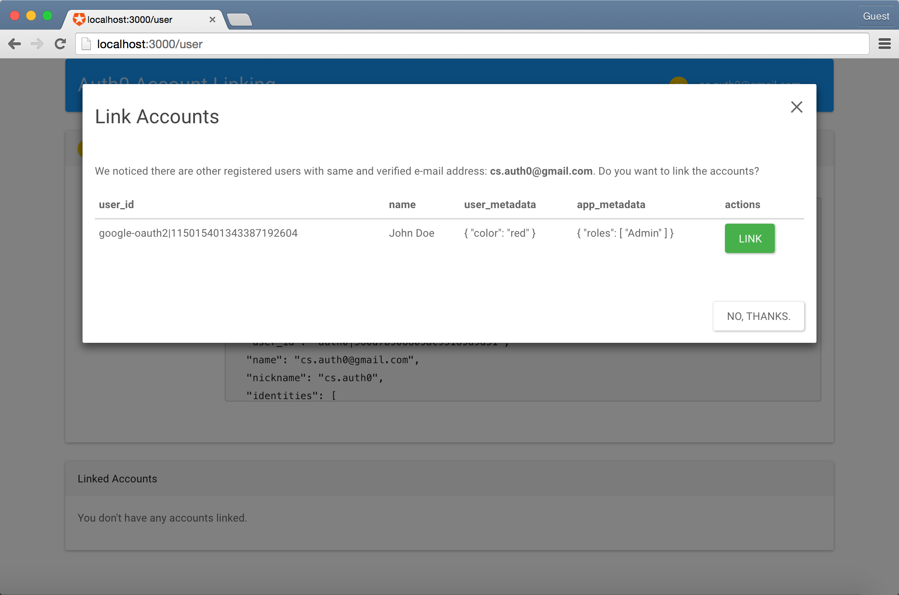
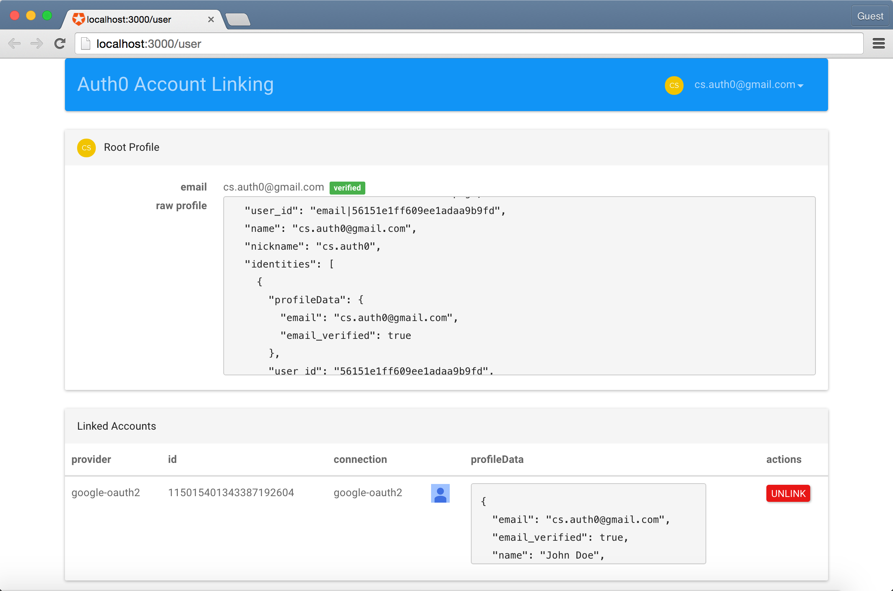

# Auth0 Node.js Regular Web App Account Linking Sample

This Node.js Regular Web App serves as an example of the [Suggested Account Linking Scenario](https://auth0.com/docs/link-accounts/suggested-linking), where the App searches for other accounts with same verified email address after user logs in, and suggests him to link the accounts if any match is found.

## Key Features

* Login with any available connection using [Lock](https://github.com/auth0/lock)
* Login with email passwordless connections, using [Lock](https://github.com/auth0/lock)
* Suggestion of linking to other accounts if other accounts with same verified email address are found
* Automatically merge user_metadata and app_metadata on account linking
* Display of current profile and linked accounts
* Option to unlink an account

## Install Locally

1. Install Node.js v4.0.0 or later
2. Generate an APIv2 token with `read:users` and `update:users` scopes.
3. Add a .env file containing your credentials. You can use sample.env as template.
4. In your App's configuration on the [Auth0 Dashboard](https://manage.auth0.com), add `http://localhost:3000/callback` to the list of **Allowed Callback URLs**. 
5. Make sure you have at least two enabled econnections where you can login with the same email.
6. Run: `npm install` and `npm run start`
7. Go to `http://localhost:3000` and you'll see the app running :).

## Usage

* Go to http://localhost:3000 and press any of the login buttons to log in to the App.
* In order to see the suggestion to link to other accounts with same verified email, you need to have another user associated with the app. If you don't see it, you can logout and login again with another account with same email. If you use a passwordless connection, the email will be automatically verified on login.
* In order to test the merging of app_metadata and user_metadata, make sure both users have some data before linking the accounts.
* You will see a modal suggesting you to link the accounts that have same verified email addresses. 
* Click the button to link the accounts.
* Try unlinking accounts, too.

## What is Auth0?

Auth0 helps you to:

* Add authentication with [multiple authentication sources](https://docs.auth0.com/identityproviders), either social like **Google, Facebook, Microsoft Account, LinkedIn, GitHub, Twitter, Box, Salesforce, amont others**, or enterprise identity systems like **Windows Azure AD, Google Apps, Active Directory, ADFS or any SAML Identity Provider**.
* Add authentication through more traditional **[username/password databases](https://docs.auth0.com/mysql-connection-tutorial)**.
* Add support for **[linking different user accounts](https://docs.auth0.com/link-accounts)** with the same user.
* Support for generating signed [Json Web Tokens](https://docs.auth0.com/jwt) to call your APIs and **flow the user identity** securely.
* Analytics of how, when and where users are logging in.
* Pull data from other sources and add it to the user profile, through [JavaScript rules](https://docs.auth0.com/rules).

## Create a free Auth0 Account

1. Go to [Auth0](https://auth0.com) and click Sign Up.
2. Use Google, GitHub or Microsoft Account to login.

## Issue Reporting

If you have found a bug or if you have a feature request, please report them at this repository issues section. Please do not report security vulnerabilities on the public GitHub issue tracker. The [Responsible Disclosure Program](https://auth0.com/whitehat) details the procedure for disclosing security issues.

## Author

[Auth0](auth0.com)

## License

This project is licensed under the MIT license. See the [LICENSE](LICENSE) file for more info.