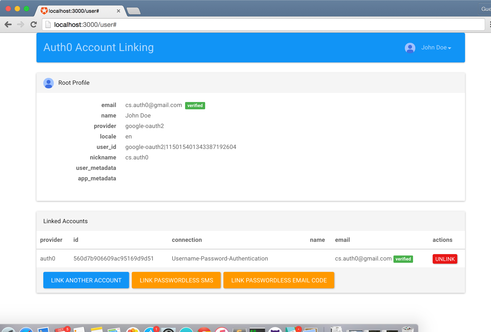

# Auth0 Node.js Regular Web App Account Linking Sample

This sample shows how to [link and unlink accounts from server side code](https://auth0.com/docs/link-accounts/server-side) within a Node.js Regular Web App.

## Key Features

The Regular Web App Account Linking Sample includes:

* Login with any available connection using [Lock](https://github.com/auth0/lock)
* Login with any passwordless connections, using [Lock Passwordless](https://github.com/auth0/lock-passwordless)
* Notice of existance of other accounts with same verified email address to link to
* Display of current profile and already linked accounts
* Option to unlink an account
* Option to link another account
* Option to link to a passwordless account

## Install Locally

1. Install Node.js v4.0.0 or later
2. Generate an APIv2 token with `read:users` and `update:users` scopes.
3. Add a .env file containing your credentials. You can use sample.env as template.
4. In your App's configuration on the [Auth0 Dashboard](https://manage.auth0.com), add `http://localhost:3000/callback` and `http://localhost:3000/user` to the list of **Allowed Callback URLs**. 
5. Run: `npm install` and `npm run start`
6. Go to `http://localhost:3000` and you'll see the app running :).

## Usage

* Go to http://localhost:3000 and press any of the login buttons to log in to the App.
* In order to see the suggestion to link to other accounts with same verified email, you need to have another user associated with the app. If you don't see it, you can logout and login again with another account with same (verified) email.
* You will see a modal suggesting you to link the accounts that have same verified email addresses. 
* Click the button to link the accounts.
* You can also click on any of the link accounts buttons to manually initiate an account linking
* Try unlinking accounts, too.