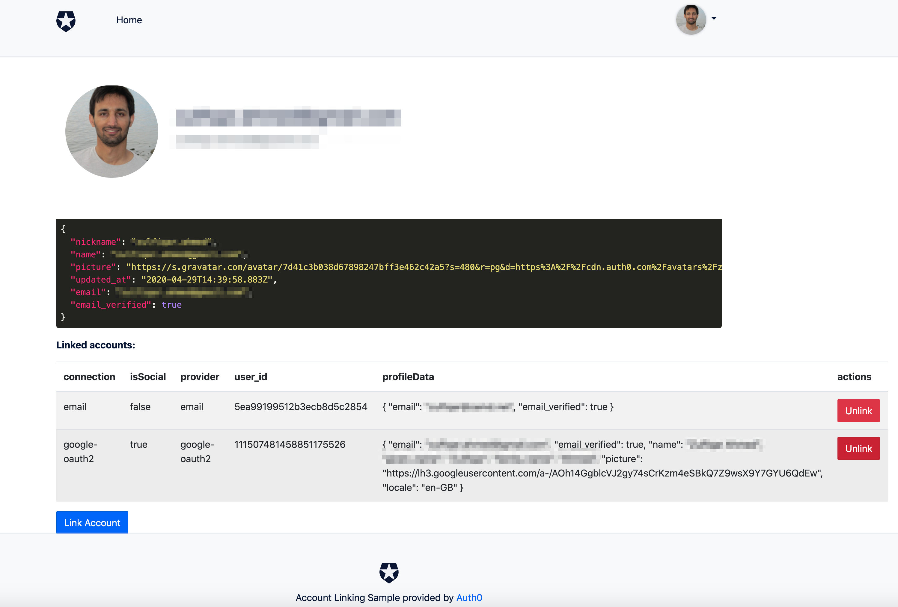

# Auth0 SPA (Vanilla JS) Account Linking Sample

This Single Page App serves as an example of the [User Initiated Account Linking Scenario](https://auth0.com/docs/link-accounts/user-initiated), where the user can click on a **Link Account** button and login with other identity to link to.

The sample use the [default iframe implementation](https://auth0.com/docs/api-auth/tutorials/silent-authentication#renew-expired-tokens) of auth0-spa-js for silent authentication, which requires 3rd party cookies to be enabled. The following warning message will be logged if 3rd party cookies are disabled.

```
Silent authentication failed with *login_required* error. This is possibly due to 3rd party cookies blocked in the browser.
Considering using a custom domain or refresh_token mode of the SDK.
```

You can switch to use a [custom domain](https://auth0.com/docs/custom-domains) or [rotating refresh_token](https://github.com/auth0/auth0-spa-js#refresh-tokens) option of the SDK if 3rd parties are disabled in your environment.

**For security reasons, the user performing the account linking and the account being linked must both have email_verified set to true. The sample will enforce this constrain during account linking.**

## Key Features

- Login with any available connection using [Universal Login](https://auth0.com/docs/universal-login)
- Display of current profile and already linked accounts
- Option to unlink an account
- Option to link another account



## Install Locally

1. Make a copy of `auth_config.json.example` and rename it to `auth_config.json`. Then open it in a text editor and supply the client_id and domain values for your application. You can get the client_id and domain from the [Auth0 Dashboard](https://manage.auth0.com).
2. In your App's configuration on the [Auth0 Dashboard](https://manage.auth0.com), add `http://localhost:3000` to the list of **Allowed Callback URLs**, **Allowed Logout URLs** and **Allowed Web Origins**.

3. From the SPA folder, run:

```
- npm install
- npm start
```

4. Go to the [index page](http://localhost:3000) and start playing with the app!
